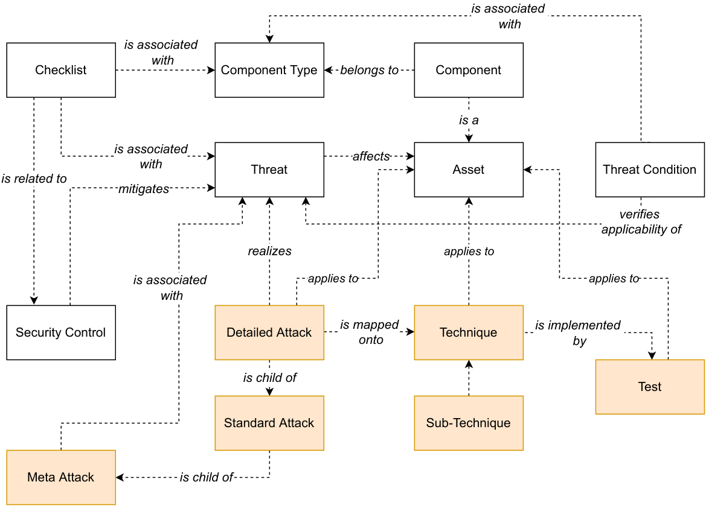
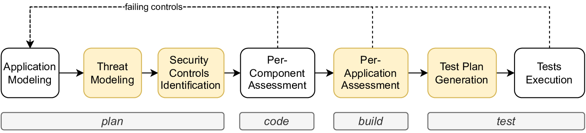
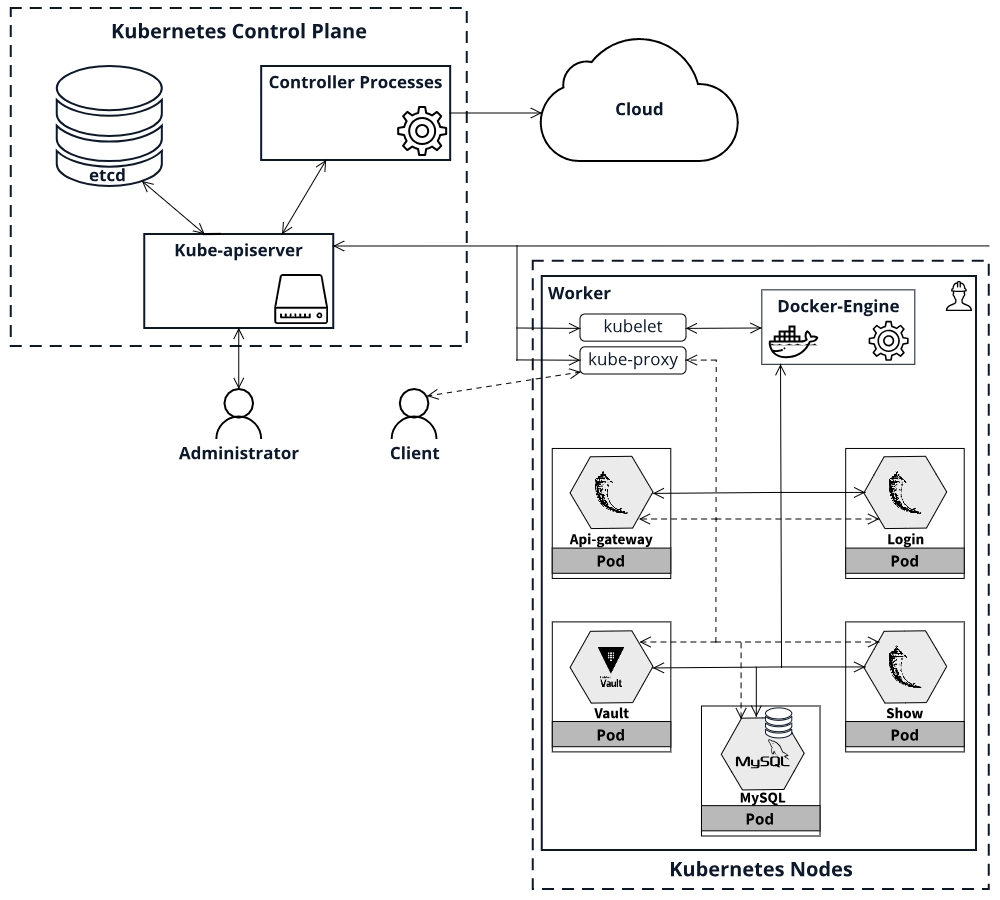

# Model-based Methodology for Secure Development and Testing
Modern industries widely rely upon software and IT services, in a context where cybercrime is rapidly spreading in more and more sectors. 
Unfortunately, despite greater general awareness of security risks and the availability of security tools that can help to cope with those risks, many organizations (especially medium/small-size ones) still lag when it comes to building security into their services.
This is mainly due to the limited security skills of common developers/IT project managers and the typically high costs of security procedures. While automated tools exist to perform code analysis, vulnerability scanning, or security testing, the manual intervention of security experts is still required not only for security analysis and design but also to configure and elaborate the output of the security testing tools. 

We propose a novel secure development methodology aimed at supporting security design and testing through semi-automated activities. The proposed methodology leverages a model-based process that enables identifying existing threats, evaluating the associated risks, and verifying the proper enforcement of the mitigation measures expected against the applicable threats through static assessment procedures and targeted security tests. 

## Threat Catalogue

Our methodology relies on a Threat Catalogue, which comprises a collection of threats related to the assets (e.g., database, web server, etc) that typically compose modern software systems. The catalogue correlates threats, assets, and [NIST security control](https://csrc.nist.gov/Projects/risk-management/sp800-53-controls/release-search#/families?version=5.1). Furthermore, it also associates threats and [CAPEC attack patterns](https://capec.mitre.org/), which are common attributes and approaches used by attackers when exploiting a weakness in computer systems. CAPEC attack patterns are then bound to [MITRE ATT&CK](https://attack.mitre.org/), which is a knowledge base of adversary tactics and techniques. By using the Threat Catalogue, a developer can be easily provisioned with a set of security tests specific to the application under development. 



The catalogue is fully extensible, any suggestions or contributions are really welcomed!

Our Threat Catalogue is implemented through the following files:

- *Threat_AttackPattern_Catalogue.xlsx*: It provides the association between a collection of threats related to assets and CAPEC attack patterns
- *AttackPattern_Attack_Catalogue.xlsx*: It correlates CAPEC attack patterns and MITRE ATT&CK tactics and techniques

## Overview of the Proposed Methodology



A developer who wants to adopt the proposed methodology should follow the following steps:

1.  Model an application according to the asset types supported by the Threat Catalogue; 
2.  Collect all the threats that threaten the application;
3.  Implement corresponding security controls;
4.  Identify attack patterns associated with the identified threats;
5.  Determine attack tactics and techniques corresponding to previously identified attack patterns;
6.  Test the applications against the collected tactics and techniques;
7.  Successful tests force the developer to fix corresponding security controls.

## Usage

This repo contains a Python script (*security_test_plan.py*) that, given a file (e.g., *text_file.txt*) containing the threats of an asset, produces the corresponding security test plan (e.g., *text_file_test_plan.txt*). The security test plan comprises the set of attacks to perform to test that component.  

The files containing threats are generated through the [Multi-Application Composition Model (MACM)](https://github.com/DanieleGranata94/SlaGenerator/tree/main).

```bash
# Install dependencies
pip install -r requirements.txt

# Generate the security test plan
python3 security_test_plan.py <text-file.txt> Threat_AttackPattern_Catalogue.xlsx AttackPattern_Attack_Catalogue.xlsx
```

### Example of Usage 

The folder *test* includes the files with the threats associated with the assets of the application shown below. For each of the files, run the following command:

```bash
# Generate the security test plan for a component 
python3 security_test_plan.py ./test/<file_name.txt> Threat_AttackPattern_Catalogue.xlsx AttackPattern_Attack_Catalogue.xlsx

# To generate the security test plan for each component in the test directory
./test.sh
```

The security test plans will be stored in a directory named *security_test_plan*. As an illustrative example, we report the security test plan for the Vault component, which is available in the file *vault_threats_test_plan.json*.


